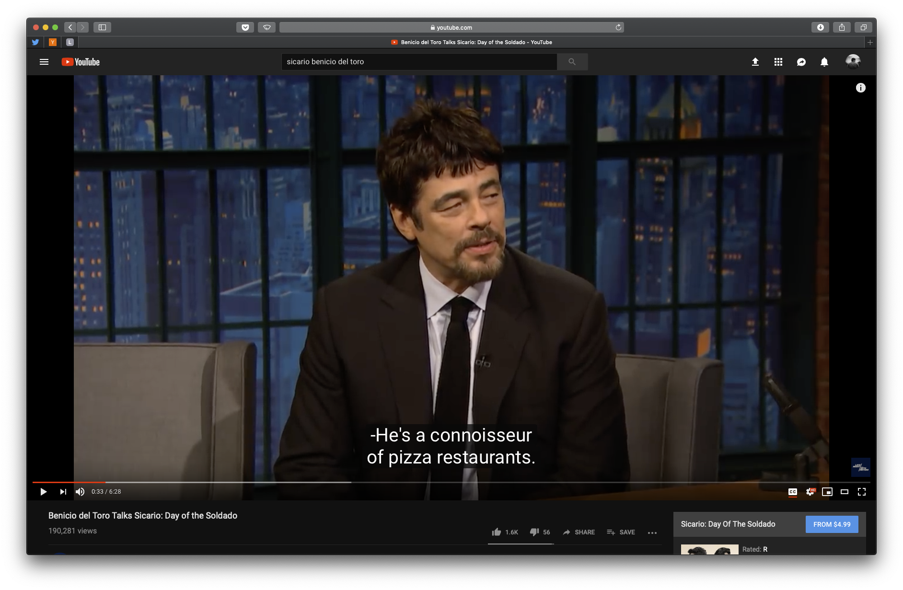
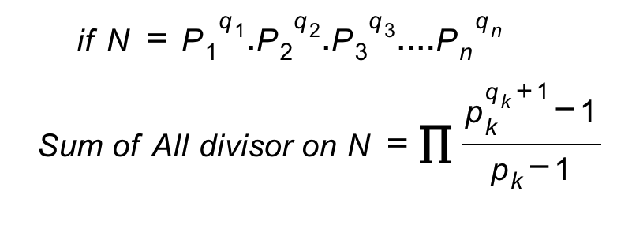

# GRE Tips

## Verbal reasoning

[Absolutely Essential words](Words.md)

### How to learn words! With the help of Youtube
Here is a quick explanation: Let say that you want to learn the word "connoisseur" which means "A connoisseur is a person who has a great deal of knowledge about the fine arts, cuisines, or an expert judge in matters of taste." You simply can watch the Benicio del Toro's Interview with Seth Meyers. In this interview, Benicio mentions that his brother is a connoisseur of pizza restaurants! This a pretty good way to remember what "connoisseur" means!

### TODO: Create a script to search Youtube with GRE Words. (It's totally doable with Youtube-dl and some time and effort)

## Quantitative Reasoning Pro Tips!

1. The number "1" (one) is not Prime! Surprise 😲
1. Sum of all divisors of a given number ``n``:
